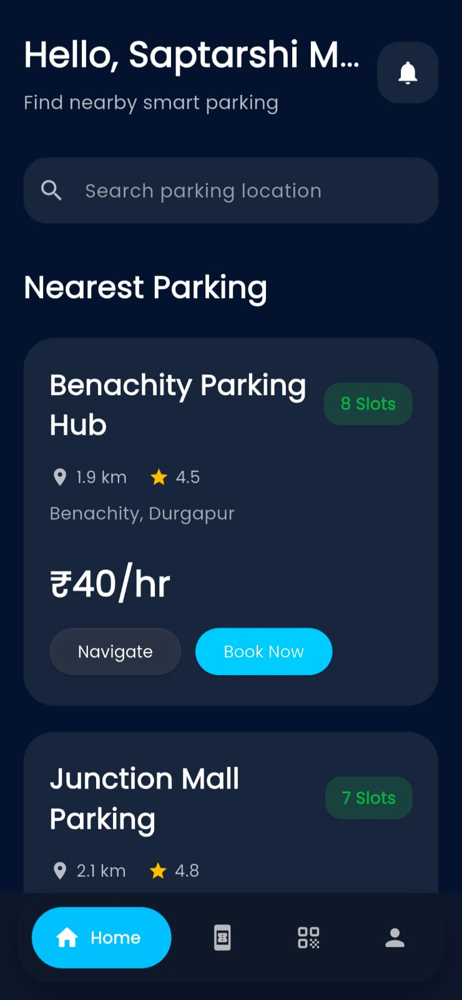
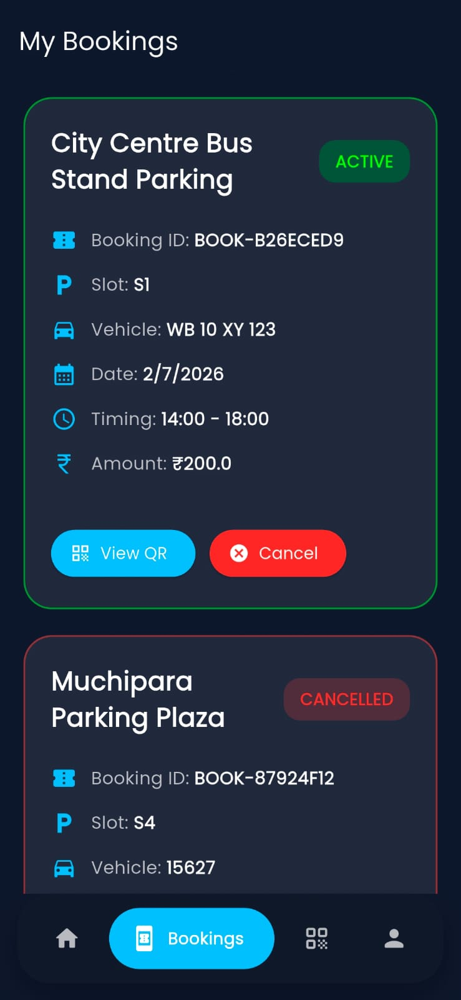
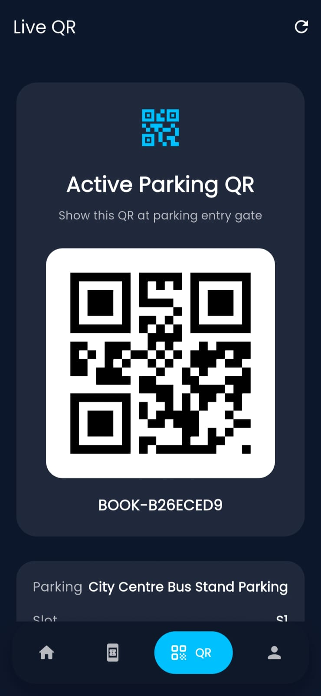

# 🚗 Smart Parking System

> **An IoT-based Smart Parking Management System with Flutter, Flask, ESP32, ESP32-CAM, QR Authentication, Real-Time Slot Monitoring.**

<p align="center">


</p>

---

## 📖 Project Overview

The **Smart Parking System** is an IoT-enabled parking management solution designed to reduce parking congestion and improve the overall parking experience. The system combines **Flutter**, **Flask**, **ESP32**, **ESP32-CAM**, **PostgreSQL** - to provide secure QR-based authentication, real-time parking slot monitoring, and automated gate control.

The mobile application allows users to view parking availability, book slots, generate QR codes, and monitor their parking status. The backend communicates with IoT hardware to manage parking operations, while the ESP32 and ESP32-CAM handle sensor data, QR code verification, and automated entry/exit gates.

The project was developed as a **Final Year B.Tech Project** to demonstrate the integration of IoT devices, embedded systems, mobile application development, backend services, and intelligent parking management.

---

## ✨ Key Features

- 🚗 **Real-Time Parking Slot Monitoring** using IR sensors to detect slot occupancy.
- 📱 **Flutter Mobile Application** for booking, monitoring, and managing parking slots.
- 🔐 **Secure QR Code Authentication** for authorized vehicle entry.
- 📷 **ESP32-CAM QR Scanner** to validate users before opening the entry gate.
- 🚦 **Automatic Entry & Exit Gate Control** using servo motors.
- 📊 **Live Parking Availability** displayed on both the mobile app and LCD.
- 🌐 **Flask REST API Backend** for communication between the mobile app and hardware.
- 🗄️ **PostgreSQL Database** for storing users, bookings, parking status, and history.
- 📅 **Booking History & User Management** with secure login and registration.
- ⚡ **IoT Integration** enabling seamless communication between hardware and software components.

---

# 🛠️ Hardware Components

The hardware prototype integrates IoT sensors, microcontrollers, and actuators to automate parking management. The following components were used in the implementation:

| Component | Quantity | Purpose |
|-----------|:--------:|---------|
| ESP32 DevKit V1 | 1 | Main microcontroller for processing sensor data and controlling the system |
| ESP32-CAM (AI Thinker) | 1 | QR code scanning and user authentication |
| IR Obstacle Sensors | 7 | 1 Entry sensor, 1 Exit sensor, and 5 Slot occupancy sensors |
| SG90 Servo Motors | 2 | Automatic opening and closing of entry and exit gates |
| 16×2 LCD Display with I2C | 1 | Displays parking status and gate information |
| Red LED | 1 | Indicates parking full or warning status |
| Green LED | 1 | Indicates parking slot availability |
| MB102 Breadboard Power Supply | 1 | Provides regulated 5V and 3.3V power |
| Breadboard | 2 | Circuit prototyping and component connections |
| Jumper Wires | As Required | Electrical connections between components |
| 5V 2A DC Power Adapter | 1 | Powers the complete hardware setup |
| USB Cable | 2 | Programming and powering ESP32 devices |
| FTDI USB-to-TTL Programmer | 1 | Uploading firmware to the ESP32-CAM |
| QR Code | As Required | Vehicle authentication at the entry gate |


---

---

## 🔌 Circuit Diagram

The following circuit diagram illustrates the hardware connections of the Smart Parking System, including the ESP32 DevKit, ESP32-CAM, IR sensors, servo motors, LCD display, LEDs, and power supply.

<p align="center">
  
</p>

<p align="center">
<b>Figure: Smart Parking System Circuit Diagram</b>
</p>

---

## 💻 Software & Technology Stack

The Smart Parking System combines mobile application development, backend services, IoT hardware, and database technologies to deliver a complete parking management solution.

| Technology | Purpose |
|------------|---------|
| Flutter | Cross-platform mobile application development |
| Dart | Programming language for Flutter application |
| Python | Backend development and business logic |
| Flask | REST API for communication between the mobile application and hardware |
| PostgreSQL | Database for storing users, bookings, and parking records |
| ESP32 DevKit V1 | Main IoT controller for parking management |
| ESP32-CAM | QR code scanning and camera-based authentication |
| Arduino IDE | Programming ESP32 and ESP32-CAM |
| Visual Studio Code | Development environment |
| Git & GitHub | Version control and project management |

### 🛠️ Development Tools

- **Frontend:** Flutter, Dart
- **Backend:** Python, Flask
- **Database:** PostgreSQL
- **IoT Hardware:** ESP32 DevKit V1, ESP32-CAM
- **Development Tools:** Visual Studio Code, Arduino IDE
- **Version Control:** Git & GitHub

---

# 📱 Application Screenshots

The Flutter mobile application provides a user-friendly interface for booking parking slots, viewing real-time availability, accessing QR-based authentication, and managing user profiles.

<table align="center">
  <tr>
    <th>Login</th>
    <th>Dashboard</th>
  </tr>
  <tr>
    <td align="center">
      
    </td>
    <td align="center">
      
    </td>
  </tr>

  <tr>
    <th>Bookings</th>
    <th>QR Code</th>
  </tr>
  <tr>
    <td align="center">
      
    </td>
    <td align="center">
      
    </td>
  </tr>

  <tr>
    <th colspan="2">Profile</th>
  </tr>
  <tr>
    <td colspan="2" align="center">
      
    </td>
  </tr>
</table>

---
# 🏗️ System Architecture

The Smart Parking System follows a multi-layer architecture that integrates a Flutter mobile application, Flask backend, PostgreSQL database, IoT hardware, and camera-based QR authentication to provide a seamless parking experience.

```text
                    +----------------------+
                    |   Flutter Mobile App |
                    +----------+-----------+
                               |
                               | REST API
                               |
                    +----------v-----------+
                    |    Flask Backend     |
                    +----------+-----------+
                               |
              +----------------+----------------+
              |                                 |
              |                                 |
     +--------v--------+              +---------v---------+
     | PostgreSQL DB   |              |   ESP32 DevKit    |
     +-----------------+              +---------+---------+
                                                |
                     +--------------------------+-------------------------+
                     |                          |                         |
             +-------v------+          +--------v-------+         +------v------+
             | Entry Sensor |          | Slot Sensors   |         | Exit Sensor |
             +--------------+          +----------------+         +-------------+
                     |                          |                         |
              +------v------+            +------v------+          +-------v------+
              | Entry Servo |            | LCD Display |          | Exit Servo   |
              +-------------+            +-------------+          +--------------+
                                                |
                                        +-------v-------+
                                        | ESP32-CAM     |
                                        | QR Validation |
                                        +---------------+
```

### Workflow

1. User registers and logs in through the Flutter application.
2. A parking slot is booked, and a unique QR code is generated.
3. The user scans the QR code at the entrance using the ESP32-CAM.
4. The Flask backend validates the booking and user information.
5. If authentication is successful, the ESP32 opens the entry gate.
6. IR sensors continuously monitor slot occupancy.
7. Live parking status is updated in the PostgreSQL database.
8. The mobile application displays real-time slot availability.
9. At exit, the IR sensor detects the vehicle and the exit gate opens automatically.


---

# 📂 Project Structure

```text
Smart-Parking-System/
│
├── 📄 README.md                     # Project documentation
├── 📄 .gitignore                    # Git ignore rules
│
├── 📁 docs/                         # Project documents
│   ├── Smart Parking System Document.pdf
│
├── 📁 hardware/                     # Hardware resources
│   ├── Hardware Components.pdf
│   ├── Smart Parking System Circuit Design.png
│
├── 📁 screenshots/                  # Application screenshots
│   ├── login.png
│   ├── dashboard.png
│   ├── bookings.png
│   ├── qr_code.png
│   └── profile.png
│
├── 📁 smart_parking_app/            # Flutter mobile application
│   ├── lib/
│   ├── android/
│   ├── ios/
│   ├── pubspec.yaml
│   └── ...
│
└── 📁 smart_parking_backend/        # Flask backend
    ├── app.py
    ├── database.py
    ├── models.py
    ├── config.py
    ├── qr_generator.py
    ├── qr_scanner.py
    ├── requirements.txt
    └── Procfile
```

## 📁 Directory Overview

| Folder | Description |
|---------|-------------|
| **smart_parking_app** | Flutter mobile application for users |
| **smart_parking_backend** | Flask backend, REST APIs, QR authentication, and database operations |
| **hardware** | Circuit diagrams and hardware-related resources |
| **docs** | Project documentation and reports |
| **screenshots** | Screenshots of the mobile application |


---

# 🚀 Installation & Setup

Follow these steps to set up and run the Smart Parking System on your local machine.

## 📋 Prerequisites

Make sure you have the following installed:

- Flutter SDK
- Python 3.10 or later
- PostgreSQL
- Arduino IDE
- Git
- Visual Studio Code

---

## 1️⃣ Clone the Repository

```bash
git clone https://github.com/YOUR_USERNAME/Smart-Parking-System.git
cd Smart-Parking-System
```

> Replace `YOUR_USERNAME` with your GitHub username.

---

## 2️⃣ Backend Setup

Navigate to the backend folder:

```bash
cd smart_parking_backend
```

Create a virtual environment (optional but recommended):

```bash
python -m venv venv
```

Activate the virtual environment:

**Windows**

```bash
venv\Scripts\activate
```

**Linux / macOS**

```bash
source venv/bin/activate
```

Install the required packages:

```bash
pip install -r requirements.txt
```

Configure your PostgreSQL database by updating the database credentials in the configuration file.

Run the backend server:

```bash
python app.py
```

---

## 3️⃣ Mobile App Setup

Open a new terminal.

Navigate to the Flutter project:

```bash
cd smart_parking_app
```

Install dependencies:

```bash
flutter pub get
```

Run the application:

```bash
flutter run
```

---

## 4️⃣ ESP32 & ESP32-CAM Setup

- Upload the ESP32 firmware using Arduino IDE.
- Upload the ESP32-CAM firmware.
- Connect all hardware components according to the circuit diagram.
- Ensure both ESP32 boards are connected to the same Wi-Fi network as the backend server.

---

## 5️⃣ Verify the System

- Register a new user.
- Log in to the mobile application.
- Book a parking slot.
- Generate the QR code.
- Scan the QR code using the ESP32-CAM.
- Verify that the entry gate opens automatically.
- Monitor real-time parking slot status.


---

# 🔮 Future Enhancements

The Smart Parking System can be further improved with the following features:

- 🚘 AI-based Automatic Number Plate Recognition (ANPR)
- ☁️ Cloud Deployment for Global Access
- 📱 Push Notifications for Booking Updates
- 📊 Admin Analytics Dashboard
- 🏢 Multi-floor Parking Management
- ⚡ Fast Charging Slot Reservation for Electric Vehicles
- 📈 Parking Usage Analytics and Reports
- 🤖 AI-Based Parking Space Prediction

---

# 👨‍💻 Author

**Saptarshi Maji**

B.Tech in Computer Science & Engineering

Final Year Project

📧 Email: saptarshimaji13@gmail.com

🔗 GitHub: https://github.com/SaptarshiMaji

🔗 LinkedIn: https://www.linkedin.com/in/saptarshi-maji-b3536627b/

---

# 📄 License

This project is developed for **educational and portfolio purposes**. Feel free to explore the code and learn from the implementation. If you use this project or its ideas, appropriate credit is appreciated.

---

# 🙏 Acknowledgements

This project was developed as part of the **Bachelor of Technology (B.Tech) Final Year Project** in **Computer Science & Engineering**.

The project integrates **Flutter**, **Flask**, **PostgreSQL**, **ESP32**, **ESP32-CAM**, **IoT**, and **Machine Learning** to demonstrate a modern smart parking solution.

Special thanks to our project guide, faculty members, and teammates for their valuable guidance and support throughout the development of this project.